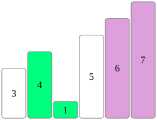

# Algviz

Algviz is an algorithm visualization tool for Jupyter-notebook.

Algviz can generate visualize animations for [vector](examples/vector.ipynb), [table](examples/table.ipynb), [linked list](examples/linked_list.ipynb), [tree](examples/tree.ipynb) and [graph](examples/graph.ipynb) data structures.
You can bring your code to life after insert a few algviz [interfaces](https://algviz.readthedocs.io/en/latest/algviz.html#module-algviz) into code. All the animations were 
generated in real time, so you can easily preview the changes of the data with animation like that:



If you come up with a good algorithm that can solve a problem, but don't know how to describe it to your friends. At this point, you can use algviz to create an intuitive animation demo to show to working process of your algorithm. The point is, you don't need to know about fundamentals of animation at all. Leave the dirty work to algviz and just focus on how to implement your algorithm.

It's useful when you try to express the working process of a complex algorithm.
For example, it's hard to image in mind the whole detail of "[mirror binary tree](examples/tree.ipynb)" algorithm.
Because the algorithm including some recursive operations on a binary tree, which subtree was moved first is a headache problem. But no matter how complex the binary tree is, algviz can tell you how the algorithm works by intuitive animations.

This animation below shows one swap subtrees operation in mirror binary tree algorithm:



Furthermore, algviz provides some encapsulated data classes which support operations like python builtin class. For example, you can iterate on the [algviz.Vector](https://algviz.readthedocs.io/en/latest/algviz.html#algviz.vector.Vector) class just like Python list:

```python
import algviz                   # Import algviz library.
viz = algviz.Visualizer()       # Create a visualizer object.
data = [1, 2, 3]
vector = viz.createVector(data) # Create a vector data object.
for num in vector:              # Iterate over all the elements in vector.
    print(num)
    viz.display()               # Refresh the animation in Jupyter-notebook.
```

You can modify the data multi-times, and algviz will record all the operations since last time you call the [display](https://algviz.readthedocs.io/en/latest/algviz.html#algviz.visual.Visualizer.display) interface. Then it will merge all the operations in one animation when you call display next time. So the only thing you need to concern is: `when to call the display interface?` Because some operations may override other operations and the output animation may be confusing.

These animations below shows multiple operations in one render output:

+ Two [insert](https://algviz.readthedocs.io/en/latest/algviz.html#algviz.vector.Vector.insert) operations on vector. (Insert two elements "0" and "1" into vector ["a", "b", "c"].)

    

+ Modify two edges on graph. ([Add](https://algviz.readthedocs.io/en/latest/algviz.html#algviz.graph.GraphNode.add) node7 into node5's neighbors;
[Remove](https://algviz.readthedocs.io/en/latest/algviz.html#algviz.graph.GraphNode.remove) nodes4 from node5's neighbors).

    

All the animations created by algviz are [SVG](https://www.w3.org/Graphics/SVG/) string format. You can export the animation frames and review it in browser or embedded it in your slides.


# Installation

## Step1: Install Jupyter-notebook

Algviz can only run in [Jupyter-notebook](https://jupyter.org/). You can choose any of the following methods to install Jupyter-notebook.

+ If you are a vscode user, you can install Jupyter [extension](https://marketplace.visualstudio.com/items?itemName=ms-toolsai.jupyter) for vscode.
+ [Install Jupyter](https://jupyter.org/install) in your computer and view the animation on your browser.
+ [Install anaconda](https://docs.anaconda.com/anaconda/install/index.html) and [use Jupyter-notebook](https://docs.anaconda.com/ae-notebooks/user-guide/basic-tasks/apps/jupyter/index.html) in it.

## Step2: Install Graphviz

[Graphviz](https://graphviz.org/) was used to generate static layout of topology graph.
It's a popular open source software, you can download the program in it's [official site](https://graphviz.org/download/).

*Note: please remember to add graphviz into your system's environment path so that other programs can call it directly.*

## Step3: Install algviz

Note: algviz run on Python 3.7 or heigher version of Python.

```shell
python -m pip install --upgrade pip
pip install algviz
```

# Usage

There are some example in the `examples` folder. You can open it in your Jupyter-notebook and run the code to see animation output. These is the examples:

+ [vector](examples/vector.ipynb) shows how to create [Vector](https://algviz.readthedocs.io/en/latest/algviz.html#algviz.vector.Vector) object and access, modify, mark elements in it.
+ [table](examples/table.ipynb) shows how to create [Table](https://algviz.readthedocs.io/en/latest/algviz.html#algviz.table.Table) object and visit, mark elements in it.
+ [linked_list](examples/linked_list.ipynb) shows how to use [ForwardLinkedNode](https://algviz.readthedocs.io/en/latest/algviz.html#algviz.linked_list.ForwardLinkedListNode) and [DoublyLinkedNode](https://algviz.readthedocs.io/en/latest/algviz.html#algviz.linked_list.DoublyLinkedListNode) to track and modify different type of linked list.
+ [tree](examples/tree.ipynb) shows how to create a [binary tree](https://algviz.readthedocs.io/en/latest/algviz.html#algviz.tree.parseBinaryTree) or [normal tree](https://algviz.readthedocs.io/en/latest/algviz.html#algviz.tree.parseTree), and use [BinaryTreeNode](https://algviz.readthedocs.io/en/latest/algviz.html#algviz.tree.BinaryTreeNode) and [TreeNode](https://algviz.readthedocs.io/en/latest/algviz.html#algviz.tree.TreeNode) to visit, modify the tree.
+ [graph](examples/graph.ipynb) shows how to create a directly or undirectly [graph](https://algviz.readthedocs.io/en/latest/algviz.html#algviz.graph.parseGraph) and use the [GraphNode](https://algviz.readthedocs.io/en/latest/algviz.html#algviz.graph.GraphNode) to track or modify graph.

For the whole API in graphviz, please read the [interface introduce of algviz](https://algviz.readthedocs.io/en/latest/algviz.html#).

# Unit test

Make sure you have successfully installed algviz and call the command:

```shell
python tests/run.py
```

If you see the output like this:

> Congratulations, everything is OK !!!

It means algviz working fine in your environment.
Otherwise please [report](https://github.com/zjl9959/algviz/issues) the bug.

# License

Algviz use GNU general pubilc [LICENSE](LICENSE). You can freely use it for non-commercial learning and communication, and **commercial use is not allowed**.

